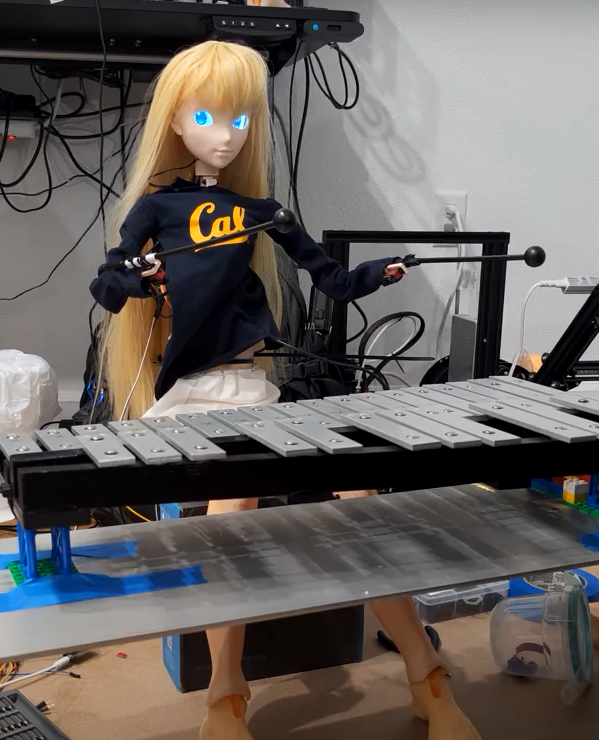

# EECS C106A Final Project

## Goal

To create an anime-style humanoid robot that can "mimic" playing music on a xylophone (via a mallet) given an "input" music/melody played by a person (i.e. piano, harmonica). The overall goal is for the robot to play back any melody of your choice.

## Keywords

Forward Kinematics, Inverse Kinematics, Path Planning, Controls, Audio Analysis, Discrete Fourier Transforms, Python APIs